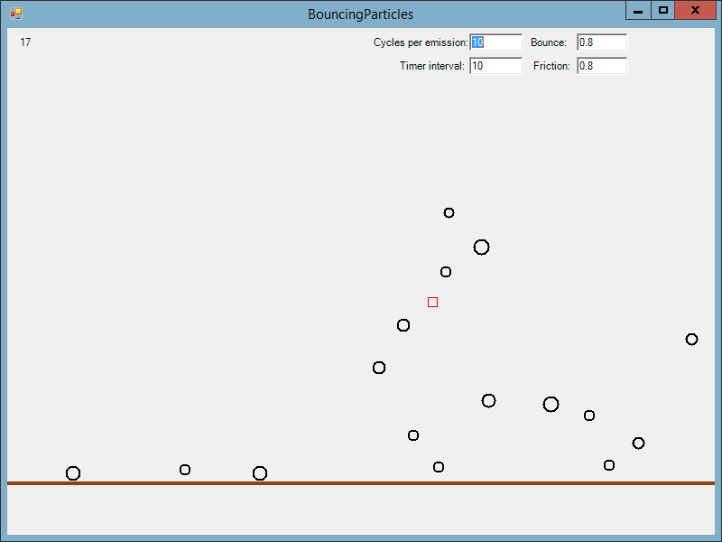

# Bouncing Particles

Windows Forms drawing demo with some physics.

## Controls

 * Click above ground to move the particle emitter
 * Click below ground to lower the ground level
 * Right-click to spawn a single particle
 * Alter the text box values to change behaviour
 
## Values

 * Cycles per emission: Lower number means that particles come out of the emitter more frequently
 * Timer interval: Lower number means smoother performance (up to a point, see **Principles** below)
 * Bounce: What fraction of their energy particles keep when they bounce. If you make this 1.0 or higher you're going to have a bad time.
 * Friction: What fraction of "rolling" energy a particle keeps per cycle when it's on the ground.
 
## Principles

If there are 10 particles on screen, it takes a certain fixed amount of time to animate them all. If it takes 2ms and we try to trigger the animation every 1ms then we're not going to get the performance we asked for. So that's why reducing the timer interval below a certain point will stop giving you performance gains. The lower limit number depends on the performance of your PC!

This app used to be powered by a `Windows.Forms.Timer` which did all the logic and drawing, but in the latest verison I have refactored it into threads. Now there is a drawing thread and a logic thread, which gives smoother performance (probably because we dropped the overhead of firing and handling the `Timer.Tick` event).

This makes it a little harder for newbies to hack with but hopefully still understandable.

## Hacking

Please play around with the moddable values and the different Pen objects within the program to have some fun!

## LICENSE

I hereby release this work into the wild under the [UNLICENSE](http://unlicense.org) license. No Copyright, no rights reserved. :)
